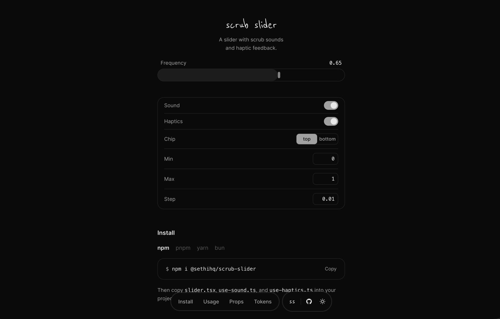

<p align="center">
  <picture>
    
  </picture>
</p>

<p align="center">
  <a href="https://scrub-slider.vercel.app">Demo</a> ·
  <a href="https://www.npmjs.com/package/@sethihq/scrub-slider">npm</a>
</p>

---

## Install

```bash
npm i @sethihq/scrub-slider
```

Or as a Claude Code skill:

```bash
npx skills add sethihq/scrub-slider
```

## Usage

```tsx
import { Slider } from "@sethihq/scrub-slider";

<Slider
  label="Frequency"
  value={frequency}
  onValueChange={setFrequency}
  min={0}
  max={1}
  step={0.01}
/>
```

## Props

#### Core

| Prop | Type | Description |
|------|------|-------------|
| `value` | `number` | Current value |
| `onValueChange` | `(v: number) => void` | Change handler |
| `min` | `number` | Minimum value |
| `max` | `number` | Maximum value |
| `step` | `number` | Step increment |

#### Display

| Prop | Type | Default | Description |
|------|------|---------|-------------|
| `label` | `string` | — | Label text |
| `unit` | `string` | — | Unit suffix (e.g. `%`) |
| `chipPosition` | `"top" \| "bottom"` | `"top"` | Hover chip position |
| `showChip` | `boolean` | `true` | Show/hide hover chip |

#### Feedback

| Prop | Type | Default | Description |
|------|------|---------|-------------|
| `enableSound` | `boolean` | `true` | Scrub sounds |
| `enableHaptics` | `boolean` | `true` | Haptic feedback |

## Tokens

```css
:root {
  --surface: #ffffff;
  --on-surface: #0a0a0a;
  --on-surface-muted: #737373;
  --outline: #e5e5e5;
  --chip: #a3a3a3;
  --on-chip: #fafafa;
}
```

## License

MIT
